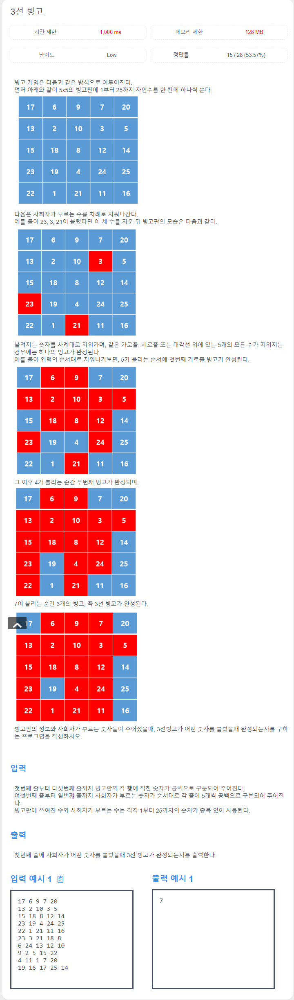
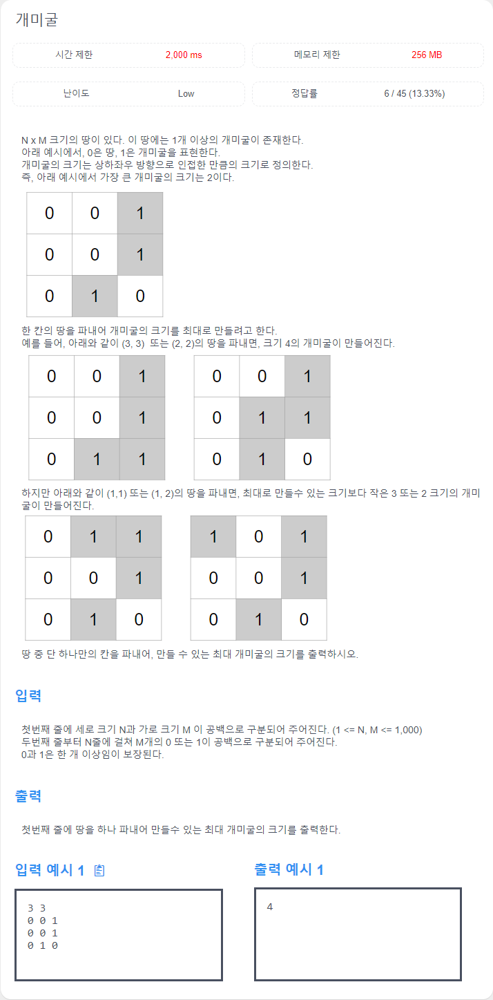

# 3선 빙고



```cpp
#include <iostream>
#include <queue>
#include <algorithm>
#include <vector>
using namespace std;

int nBingo(vector<vector<int>> marked) {

	int result = 0;
	for (int i = 0; i < 5; i++) {
		bool complete = true;
		for (int j = 0; j < 5; j++) {
			if (marked[i][j] == 0) {
				complete = false;
				break;
			}
		}
		if (complete) result++;
	}
	for (int i = 0; i < 5; i++) {
		bool complete = true;
		for (int j = 0; j < 5; j++) {
			if (marked[j][i] == 0) {
				complete = false;
				break;
			}
		}
		if (complete) result++;
	}
	bool complete = true;
	for (int i = 0; i < 5; i++) {
		if (marked[i][i] == 0) {
			complete = false;
			break;
		}
	}
	if (complete) result++;
	complete = true;
	for (int i = 0; i < 5; i++) {
		if (marked[i][4 - i] == 0) {
			complete = false;
			break;
		}
	}
	if (complete) result++;
	return result;
}

int solve(vector<vector<int>> board, vector<int> call) {
	vector<vector<int>> marked(5, vector<int>(5, 0));
	for (int i = 0; i < call.size();i++) {
		for (int j = 0; j < 5; j++) {
			for (int k = 0; k < 5; k++) {
				if (board[j][k] == call[i]) {
					marked[j][k] = 1;
					if (nBingo(marked) >= 3) {
						return call[i];
					}
				}
			}
		}
	}
}

int main() {
	vector<vector<int>> board(5, vector<int>(5));
	vector<int> call(25);
	for (int i = 0; i < 5; i++) {
		for (int j = 0; j < 5; j++) {
			cin >> board[i][j];
		}
	}
	for (int i = 0; i < 25; i++) {
		cin >> call[i];
	}
	cout << solve(board, call);
	return 0;
}
```

# 자동사냥 매크로


```cpp
#include <iostream>
#include <queue>
#include <algorithm>
#include <vector>
using namespace std;

struct Pos {
	int y, x;
	const Pos operator+(const Pos& p) const {
		return { y + p.y, x + p.x };
	}
	bool operator==(const Pos& p) const {
		return y == p.y && x == p.x;
	}
};

Pos d[4] = {
	{1, 0},
	{0, 1},
	{-1, 0},
	{0, -1}
};

int solve(int N, vector<vector<int>> map, Pos start, int level = 2, int exp=0) {
	int result = 0;
	//cout << "(" << start.y << ", " << start.x << "), " << level << ", " << exp << "\n";
	if (level == exp) {
		return solve(N, map, start, level + 1, 0);
	}
	Pos here = start;
	queue<Pos> q;
	vector<Pos> possiblePos;
	vector<vector<int>> visited(N, vector<int>(N, 0));
	int step = 0;
	q.push(here);
	while (!q.empty()) {
		int qSize = q.size();
		for (int qc = 0; qc < qSize; qc++) {
			here = q.front();
			q.pop();
			if (visited[here.y][here.x]) continue;
			visited[here.y][here.x] = 1;
			if (map[here.y][here.x] > level) {
				continue;
			}
			if (map[here.y][here.x] != 0 && map[here.y][here.x] < level) {
				possiblePos.push_back(here);
			}
			for (int i = 0; i < 4; i++) {
				Pos next = here + d[i];
				if (next.y < 0 || next.x < 0 || next.y >= N || next.x >= N) continue;
				q.push(next);
			}
		}
		if (possiblePos.size() == 0) {
			step++;
			continue;
		}
		Pos nextToGo = {N, N};
		for (Pos p : possiblePos) {
			if (nextToGo.y > p.y) {
				nextToGo = p;
			}
			if (nextToGo.y == p.y && nextToGo.x > p.x) {
				nextToGo = p;
			}
		}
		if (nextToGo == Pos{N, N}) {
			return 0;//매크로 종료
		}
		map[nextToGo.y][nextToGo.x] = 0;
		return solve(N, map, nextToGo, level, exp + 1) + step;
	}
	return 0;
}

int main() {
	int N;
	cin >> N;
	vector<vector<int>> map(N, vector<int>(N));
	Pos here = {-1, -1};
	for (int i = 0; i < N; i++) {
		for (int j = 0; j < N; j++) {
			cin >> map[i][j];
			if (map[i][j] == 9) {
				here = { i, j };
				map[i][j] = 0;
			}
		}
	}
	cout << solve(N, map, here);
	return 0;
}
```

# 개미굴



```cpp
#include <iostream>
#include <queue>
#include <algorithm>
#include <vector>
using namespace std;

struct Pos {
	int y, x;
	const Pos operator+(const Pos& p) const {
		return { y + p.y, x + p.x };
	}
};

Pos d[4] = {
	{1, 0},
	{0, 1},
	{-1, 0},
	{0, -1}
};

int getAntHoleSizeAt(int N, int M, vector<vector<int>>& board, int i, int j) {
	queue<Pos> q;
	vector<Pos> removed;
	Pos here = { i,j };
	q.push(here);
	int size = 0;
	while (!q.empty()) {
		here = q.front();
		q.pop();
		if (board[here.y][here.x] == 0) continue; // 하나 파는건 어떻게 한거지?
		board[here.y][here.x] = 0; // 왜 board[][]를 0으로 바꿔준거지?
		removed.push_back(here); // 1인데를 지우고 0으로 바꿔줬다.
		size++;
		for (int i = 0; i < 4; i++) {
			Pos next = here + d[i]; // d[i]안에 있는 것들을 푸쉬해줌.
			if (next.y < 0 || next.x < 0 || next.y >= N || next.x >= M)
				continue;
			q.push(next);
		}
	}
	for (int i = 0; i < removed.size(); i++) {
		Pos p = removed[i]; // 갯수를 셈
		board[p.y][p.x] = 1; // board에 다시 1 채워줌
	}
	return size;
}

int main() {
	int N, M;
	cin >> N >> M;
	vector<vector<int>> board(N, vector<int>(M)); // N x M 배열
	for (int i = 0; i < N; i++) {
		for (int j = 0; j < M; j++) {
			cin >> board[i][j];
		}
	}
	int result = 0;
	for (int i = 0; i < N; i++) {
		for (int j = 0; j < M; j++) {
			if (board[i][j] == 0) {
				board[i][j] = 1;
				// i, j 를 2중 for문 돌려서 ([i][j]가 0이라면 1로 바꿔서) BFS를 돌림
				int localResult = getAntHoleSizeAt(N, M, board, i, j);
				if (localResult > result) {
					result = localResult;
				}
				board[i][j] = 0;
			}
		}
	}
	cout << result;
	return 0;
}

```

# 이탈리아 전쟁


```cpp
#include <iostream>
#include <queue>
#include <algorithm>
#include <vector>
#include <cassert>
using namespace std;

struct Pos {
	int y, x;
	const Pos operator+(const Pos& p) const {
		return { y + p.y, x + p.x };
	}
};

vector<Pos> d[5] = {
	vector<Pos>{
	},
	vector<Pos>{
		Pos{1, 0},
		Pos{0, 1},
		Pos{-1, 0},
		Pos{0, -1}
	},
	vector<Pos>{
		Pos{1, 0},
		Pos{-1, 0},
		Pos{0, -1},
		Pos{1, 1}
	},
	vector<Pos>{

	},
	vector<Pos>{
		Pos{1, 1},
		Pos{1, -1},
		Pos{-1, 1},
		Pos{-1, -1}
	},
};


void solve(vector<vector<int>>& map) {
	for (int year = 0; year < 7; year++) {
		//cout << "[DEBUG] year " << year << '\n';
		//for (int i = 0; i < 10; i++) {
		//	for (int j = 0; j < 6; j++) {
		//		cout << map[i][j] << ' ';
		//	}
		//	cout << endl;
		//}
		vector<vector<int>> newMap = map;
		for (int i = 0; i < 10; i++) {
			for (int j = 0; j < 6; j++) {
				int mapHere = map[i][j];
				if (mapHere == 7) continue; //공동구역
				if (!(mapHere == 0 || mapHere == 1 || mapHere == 2 || mapHere == 4)) {
					cout << "Wrong\n"; // 오류
				}
				for (int k = 0; k < d[mapHere].size(); k++) {
					Pos next = { i + d[mapHere][k].y, j + d[mapHere][k].x };
					if (next.y < 0 || next.x < 0 || next.y >= 10 || next.x >= 6) continue;
					newMap[next.y][next.x] = newMap[next.y][next.x] | mapHere;
				}
			}
		}
		/*cout << "[DEBUG] year " << year << ", battle phase\n";
		for (int i = 0; i < 10; i++) {
			for (int j = 0; j < 6; j++) {
				cout << newMap[i][j] << ' ';
			}
			cout << endl;
		}*/

		for (int i = 0; i < 10; i++) {
			for (int j = 0; j < 6; j++) {
				switch (newMap[i][j]) {
				case 0:
					map[i][j] = 0;
					break;
				case 1:
					map[i][j] = 1;
					break;
				case 2:
					map[i][j] = 2;
					break;
				case 3:
					//묵과 찌의 배틀, 묵 승
					map[i][j] = 1;
					break;
				case 4:
					map[i][j] = 4;
					break;
				case 5:
					//묵과 빠의 배틀, 빠 승
					map[i][j] = 4;
					break;
				case 6:
					//찌와 빠의 배틀, 찌 승
					map[i][j] = 2;
					break;
				case 7:
					//공동구역 생성
					map[i][j] = 7;
					break;
				default:
					assert(false);
				}
			}
		}
	}
	for (int i = 0; i < 10; i++) {
		for (int j = 0; j < 6; j++) {
			switch (map[i][j]) {
			case 0:
				break;
			case 1:
				map[i][j] = 1;
				break;
			case 2:
				map[i][j] = 2;
				break;
			case 4:
				map[i][j] = 3;
				break;
			case 7:
				map[i][j] = 4;
				break;
			default:
				//cout << "assertion fail: map[" << i << "][" << j << "] =" << map[i][j] << '\n';
				break;
			}
		}
	}
}

int main() {
	vector<vector<int>> map(10, vector<int>(6, 0)); // map[10][6] 
	for (int i = 0; i < 10; i++) {
		for (int j = 0; j < 6; j++) {
			int t;
			cin >> t;
			switch (t) { // bitmasking 을 위해 2^0, 2^1, 2^2 로 마스킹
			case 1: //묵, bitmask(0)
				map[i][j] = 1;
				break;
			case 2: //찌, bitmask(1)
				map[i][j] = 2;
				break;
			case 3: //빠, bitmask(2)
				map[i][j] = 4;
			}
		}
	}
	solve(map);
	for (int i = 0; i < 10; i++) {
		for (int j = 0; j < 6; j++) {
			cout << map[i][j] << ' ';
		}
		cout << endl;
	}
	return 0;
}

```

# 공포게임 공략

**테스트 케이스 9/10 통과**


```cpp
#include <iostream>
#include <queue>
#include <algorithm>
#include <vector>
#include <cassert>
using namespace std;

#define EMPTY '.'
#define BLOCK '#'
#define EXIT 'E'
#define GHOST 'C'
#define CHARACTER 'S'

struct Pos {
	int y, x;
	const Pos operator+(const Pos& p) const {
		return { y + p.y, x + p.x };
	}
	bool operator==(const Pos& p) const {
		return y == p.y && x == p.x;
	}
};

Pos d[4] = {
	{1, 0},
	{0, 1},
	{-1, 0},
	{0, -1}
};

int solve(int N, int M, vector<vector<char>> map, vector<Pos> man, vector<Pos> ghost) {
	queue<Pos> manCanBeAt;
	queue<Pos> ghostCanBeAt;
	vector<vector<int>> manVisited(N, vector<int>(M, 0));
	for (auto i : man) {
		manCanBeAt.push(i);
	}
	for (auto i : ghost) {
		ghostCanBeAt.push(i);
	}
	int step = 0;
	while (true) {
		int ghostSize = ghostCanBeAt.size();
		Pos here;
		Pos next;
		int manSize = manCanBeAt.size();
		if (manSize == 0) return -1;
		for (int qc = 0; qc < manSize; qc++) {
			here = manCanBeAt.front();
			manCanBeAt.pop();
			if (manVisited[here.y][here.x]) continue;
			manVisited[here.y][here.x] = 1;
			if (map[here.y][here.x] == EXIT) {
				return step;
			}
			if (map[here.y][here.x] == GHOST) {
				continue;
			}
			for (int i = 0; i < 4; i++) {
				next = here + d[i];
				if (next.y < 0 || next.x < 0 || next.y >= N || next.x >= M) continue;
				if (map[next.y][next.x] == BLOCK) continue;
				manCanBeAt.push(next);
			}
			//here
		}
		for (int qc = 0; qc < ghostSize; qc++) {
			//유령을 움직여서, 유령이 있을 수 있는 곳은 모두 마킹.
			here = ghostCanBeAt.front();
			ghostCanBeAt.pop();
			map[here.y][here.x] = EMPTY;
			for (int i = 0; i < 4; i++) {
				next = here + d[i];
				if (next.y < 0 || next.x < 0 || next.y >= N || next.x >= M) continue;
				if (map[next.y][next.x] == BLOCK) continue;
				if (map[next.y][next.x] == EXIT) continue;
				ghostCanBeAt.push(next);
			}
		}
		ghostSize = ghostCanBeAt.size();
		for (int qc = 0; qc < ghostSize; qc++) {
			here = ghostCanBeAt.front();
			ghostCanBeAt.pop();
			if (map[here.y][here.x] == GHOST) continue;
			map[here.y][here.x] = GHOST;
			ghostCanBeAt.push(here);
		}
		step++;
	}
	return -1;
}

int main() {
	int TC;
	cin >> TC;
	for (int tc = 1; tc <= TC; tc++) {
		int N, M;
		cin >> N >> M;
		vector<vector<char>> map(N, vector<char>(M));
		vector<Pos> man;
		vector<Pos> ghost;
		for (int i = 0; i < N; i++) {
			for (int j = 0; j < M; j++) {
				cin >> map[i][j];
				if (map[i][j] == CHARACTER) {
					man.push_back({ i, j });
					map[i][j] = '.';
				}
				if (map[i][j] == GHOST) {
					ghost.push_back({ i, j });
				}
			}
		}
		int result = solve(N, M, map, man, ghost);
		cout << "#" << tc << ' ' << result << '\n';
	}
	return 0;
}
```

# 장난감 조립


```cpp
#include <iostream>
#include <queue>
#include <algorithm>
#include <vector>
#include <cassert>
using namespace std;

int main() {
	int N, T;
	cin >> N >> T;
	vector<vector<pair<int,int>>> graph(N);
	for (int i = 0; i < T; i++) {
		int a, b, c;
		cin >> a >> b >> c;
		a--;
		b--;
		graph[a].push_back({ b, c });
	}
	vector<int> need(N);
	need[N - 1] = 1;
	while (true) {
		bool updated = false;
		for (int i = 0; i < N; i++) {
			if (need[i] != 0) {
				//cout << "[DEBUG] need " << i + 1 << "\n";
				if (graph[i].size() != 0) {
					for (pair<int, int> j : graph[i]) {
						//cout << "\t[DEBUG]: need[" << j.first + 1 << "] += " << j.second * need[i] << '\n';
						need[j.first] += j.second * need[i];
					}
					//cout << "\t[DEBUG]: need[" << i + 1 << "] = 0\n";
					need[i] = 0;
					updated = true;
				}
				else {
					//cout << "[DEBUG]: it is basic material\n";
				}
			}
		}
		//cout << "[DEBUG] need\n";
		//for (int i = 0; i < N; i++) {
		//	cout << need[i] << ' ';
		//}
		//cout << endl;
		if (updated == false) {
			for (int i = 0; i < N; i++) {
				if (need[i]) {
					cout << i + 1 << ' ' << need[i] << '\n';
				}
			}
			return 0;
		}
	}
	return 0;
}
```
