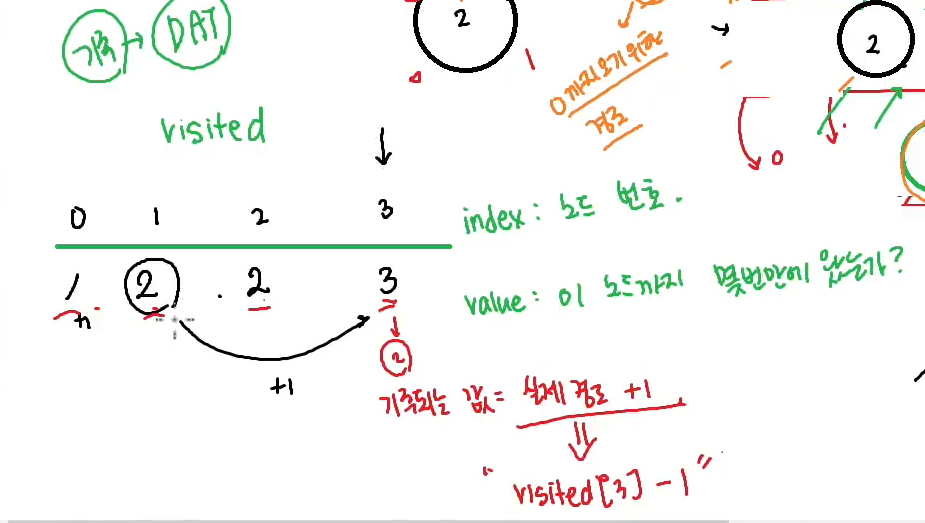

# BFS 의 뜻
**Breadth First Search, 너비 우선 탐색**
(DFS: 그래프에서의 완전 탐색)


### 너비 우선 *(가로 방향)* 탐색의 의미
**특정 노드로부터 인접한 노드 먼저 탐색**

세로 방향 탐색: 탐색한 노드에서부터 인접한 노드 먼저 탐색. ***탐색하면 탐색의 기준점이 바로 바뀜.*** 제일 깊은 노드의 탐색이 끝나면 윗 방향으로 기준이 다시 돌아감. 이후 깊이 방향으로 재 탐색, 탐색이 끝나면 윗 방향으로 또 다시 기준이 돌아감.

가로 방향 탐색: 기준점을 잡은 노드의 ***인접한 노드들의 탐색이 끝날 때 까지 탐색의 기준점이 바뀌지 않음.***

### *(참고)* Queue
먼저 들어간게 먼저 나오는 선입선출 구조 (First-In First-Out): FIFO구조

*BFS에서 사용하는 Queue는 대기열이라고 생각하자*

#### Queue 사용법
```cpp
#include <iostream>
#include <queue>
using namespace std;

int main() {
	// queue 사용법
	queue<int>q; // queue 생성

	// #1. 삽입
	q.push(1); // [ 1     ]
	q.push(2); // [ 1 2   ]
	q.push(3); // [ 1 2 3 ]

	// #2. peek -> queue의 맨 앞의 값을 확인
	cout << q.front() << endl;

	// #3. size() -> queue에 몇개의 요소가 있는가?
	cout << q.size() << endl;

	// #4. empty() -> queue가 비어있으면 true(1), 아니면 false(0)
	cout << q.empty() << endl;

	// #5. pop() -> queue의 맨 앞의 요소를 삭제
	q.pop();
	cout << q.front() << '\n';
}
```

### BFS 설계 단계
1. Queue 준비
    - Queue 생성
    - Queue 에 시작 노드 삽입
2. (cycle이 생길 시) visited 준비
    - 시작 노드를 예약 후 시작
3. BFS 동작
    - while (큐가 빌 때 까지 (내가 더이상 갈 수 있는 노드가 없을 때 까지))
      - 대기열의 맨 앞의 노드 방문
        - "NOW" => 내가 지금 방문하고 있는 노드
      - 내가 갈 수 있는 노드를 판단
        - "OK"라면 Queue 에 삽입 (visited 쓴다면 + 예약 (방문 기록))


<br><br>

> 입력 예시: 첫 줄은 간선 정보(노드의 개수, 간선의 개수), 그 이후는 edge 정보 (from, to)
> 
> 7 6
> 
> 0 1 <br> 0 2 <br> 1 3 <br> 1 4 <br> 4 5 <br> 4 6

### 인접 리스트를 활용한 풀이
```cpp
#include <iostream>
#include <queue>
using namespace std;

int N; // 노드의 개수
int M; // 간선의 개수

int mat[10][10]; // 인접 행렬

void bfs(int start) {
	// #1. queue 준비
	queue<int>q;

	// queue에 시작 노드 삽입
	q.push(start);

	// BFS 동작 -> queue에 예약된 / 가야되는 노드가 있는 동안 동작
	while (!q.empty()) {
		// #1. 대기열에서 맨 앞의 노드 방문
		int now = q.front();

		// queue 에서는 삭제
		q.pop();

		cout << now << " ";

		// #2. 갈 수 있는 노드들을 판단하고 -> 큐에다가 삽입
		// 큐에 삽입 -> 미래에 갈 노드를 확정 (미리 예약)
		for (int next = 0; next < N; next++) {
			// 만약 now -> next로 갈 수 없다면 continue
			if (mat[now][next] == 0) continue;

			// next번 노드에 갈 수 있다면 -> queue에 삽입
			q.push(next);
		}
	}
}

int main() {
	cin >> N >> M;
	// 간선 정보
	for (int i = 0; i < M; i++) {
		int from, to;
		cin >> from >> to;
		// 단방향 연결
		mat[from][to] = 1;

        // 양방향 연결
        // mat[to][from] = 1;
	}
	// BFS : 재귀적으로 동작 X
	// 함수로 만들 필요 X
	// bfs(시작 노드)
	bfs(0);
}

```

### 인접 행렬을 활용한 풀이
```cpp
#include <iostream>
#include <queue>
#include <vector>
using namespace std;

int N, M; // 노드의 개수, 간선의 개수
int mat[10][10]; // 인접 행렬
vector<int>al[10]; // 인접 리스트

void bfs2(int start) {
    // #1. queue 준비
    queue<int> q;
    q.push(start);

    // #2. bfs 동작
    while (!q.empty()) {
        int now = q.front();
        q.pop();

        cout << now << " "; // now에 들어간 노드의 순서 출력

        for (int i = 0; i < al[now].size(); i++) {
            int next = al[now][i];
            q.push(next);
        }
    }
}

int main() {
	cin >> N >> M;
	// 간선 정보
	for (int i = 0; i < M; i++) {
		int from, to;
		cin >> from >> to;
		// 단방향 연결
		mat[from][to] = 1;
        al[from].push_back(to);

        // 양방향 연결
        // mat[to][from] = 1;
        // al[to].push_back(from);
	}
	// BFS : 재귀적으로 동작 X
	// 함수로 만들 필요 X
	// bfs(시작 노드)

    // 인접리스트 bfs (왜지?)
	bfs2(0);
}
```

### 양방향 연결 (visited 사용)
```cpp
#include <iostream>
#include <queue>
using namespace std;

int N; // 노드의 개수
int M; // 간선의 개수

int mat[10][10]; // 인접 행렬

void bfs(int start) {
	// #1. queue 준비
	queue<int>q;

	// queue에 시작 노드 삽입
	q.push(start);

    // #2. visited 준비
    int visited[10] = {0, };

    // 시작 노드를 방문 처리
    visited[start] = 1;

	// BFS 동작 -> queue에 예약된 / 가야되는 노드가 있는 동안 동작
	while (!q.empty()) {
		// #1. 대기열에서 맨 앞의 노드 방문
		int now = q.front();

		// queue 에서는 삭제
		q.pop();

		cout << now << " ";

		// #2. 갈 수 있는 노드들을 판단하고 -> 큐에다가 삽입
		// 큐에 삽입 -> 미래에 갈 노드를 확정 (미리 예약)
		for (int next = 0; next < N; next++) {
			// 만약 now -> next로 갈 수 없다면 continue
			if (mat[now][next] == 0) continue;

            // 만약 이미 예약 되었거나 / 방문한 노드라면 -> 예약을 걸지 않겠다
            if (visited[next] == 1) continue;

			// next번 노드에 갈 수 있다면 -> queue에 삽입
			q.push(next);
		}
	}
}

int main() {
	cin >> N >> M;
	// 간선 정보
	for (int i = 0; i < M; i++) {
		int from, to;
		cin >> from >> to;
		// 단방향 연결
		mat[from][to] = 1;

        // 양방향 연결
        // mat[to][from] = 1;
	}
	// BFS : 재귀적으로 동작 X
	// 함수로 만들 필요 X
	// bfs(시작 노드)
	bfs(0);
}
```
> visited 설명 그림


### BFS 최종 코드
```cpp
#include <iostream>
#include <vector> 
#include <queue>
using namespace std;

int N; // 노드의 개수
int M; // 간선의 개수 

int mat[10][10]; // 인접 행렬 
vector<int>al[10]; // 인접 리스트

int v[10]; // dfs를 위한 visited

void dfs(int now) {
    cout << now << " ";
    for (int next = 0; next < N; next++) {
        if (mat[now][next] == 0)
            continue;
        if (v[next] == 1)
            continue;
        v[next] = 1;
        dfs(next); 
    }
}

// BFS
// #1. queue 준비
// --> 시작 노드 queue에 삽입

// #2. (cycle이 생길 시) visited 준비
// --> 시작 노드를 예약후 시작 

// #3. BFS 동작 -> queue에 가야하는 / 예약된 노드가 있는 동안 반복한다
// --> now -> 지금 방문하는 노드를 queue의 맨 앞에서 빼옵니다.
// --> now에서 갈수 있는 노드들을 판단하여, 갈 수 있다면, queue에 새로 삽입 + 예약 (방문 기록)

// DFS와 BFS의 시간복잡도
// 일반적인 완전 탐색 : 
// -> 인접 행렬 : O(V^2) -> V(노드의 개수)
// -> 인접 리스트 : O(V + E)

// DFS -> backtracking 
// 재귀의 시간복잡도 O(2^N)~ O(N!) 

// Upgrade -> BFS 최단경로 알고리즘
// visited에 시작 노드로부터 모든 노드까지의 최단 경로를 기록 
void bfs(int start) {
    // #1. queue 준비
    queue<int>q; 
    // queue에 시작 노드 삽입
    q.push(start);

    // #2. visited 준비
    int visited[10] = { 0, };
    /*
    for (int i = 0; i < N; i++)
        visited[i] = -1; 
    */
    // 시작 노드를 방문 처리
    //visited[start] = 0; 
    visited[start] = 1; 

    // BFS 동작 -> queue에 예약된 / 가야되는 노드가 있는 동안
    while (!q.empty()) {
        // #1. 대기열에서 맨 앞의 노드를 방문
        int now = q.front(); // now : 내가 지금 방문하고 있는 노드
        // queue에서는 삭제 
        q.pop(); 

        cout << now << " ";

        // #2. 갈수 있는 노드들을 판단하고 -> 큐에다가 삽입
        // 큐에 삽입 -> 미래에 갈 노드를 확정 (미리 예약)
        for (int next = 0; next < N; next++) {
            
            // 만약 now -> next로 갈 수 없다면 continue 
            if (mat[now][next] == 0)
                continue;

            // 만약 이미 예약되었거나 / 방문한 노드라면 -> 예약을 걸지 않겠다
            //if (visited[next] == 1)

            // 내가 이미 방문했는가? 1~어떤 값이 저장되어있겠죠? 
            // if(visited[next] != -1)
            if(visited[next] != 0) 
                continue; 

            // next번 노드에 갈수 있다! -> queue에 삽입
            q.push(next); 
            // 단순히 그냥 완전탐색 -> 그러면 (0, 1)로 왔다 안왔다만 기록 해도 됨 
            //visited[next] = 1; 
            // 지금 내가 예약하려고 하는 next까지의 경로 = now까지 온 경로에서 한번 더 움직인다!
            visited[next] = visited[now] + 1; 
        }
    }
    cout << '\n';
    // start로부터 모든 경로의 값을 출력
    for (int i = 0; i < N; i++) {
        cout << i << "까지의 최단 경로 : " << visited[i]-1 << '\n';
    }
    cout << visited[3] - 1; 
}

void bfs2(int start) {
    // #1. queue 준비
    queue<int>q;
    q.push(start);

    // #2. bfs 동작
    while (!q.empty()) {
        int now = q.front();
        q.pop(); 

        cout << now << " ";

        for (int i = 0; i < al[now].size(); i++) {
            int next = al[now][i]; 
            q.push(next); 
        }
    }
}

int main() {
    /*
    // queue 사용법
    queue<int>q; // queue 생성
    // #1. 삽입
    q.push(1); // [ 1       ]
    q.push(2); // [ 1  2    ]
    q.push(3); // [ 1  2  3 ] 
    // #2. peek -> queue의 맨 앞의 값을 확인 
    cout << q.front() << '\n';
    // #3. size() -> queue에 몇개의 요소가 있는가?
    cout << q.size() << '\n';    
    // #4. empty() -> queue가 비어있으면 true(1), 아니면 false(0)
    cout << q.empty() << '\n';
    // #5. pop() -> queue의 맨 앞의 요소를 삭제
    q.pop(); 
    cout << q.front() << '\n';
    */ 
    
    cin >> N >> M;
    // 간선 정보 
    for (int i = 0; i < M; i++) {
        int from, to;
        cin >> from >> to;
        // 양방향 연결
        mat[from][to] = 1; 
        mat[to][from] = 1; 
        al[from].push_back(to); 
        al[to].push_back(from); 
    }
    // BFS : 재귀적으로 동작 X
    // 함수로 만들 필요 X
    // bfs(시작 노드) 
    bfs(0);    

    cout << '\n';

    //v[0] = 1; 
    //dfs(0); 
    // 인접 리스트 bfs
    // bfs2(0); 
}
```

## DFS와 BFS를 둘 다 알아야 하는 이유
**DFS와 BFS의 차이점**
DFS: 모든 조합/순열 등 경우의 수를 찾는데 용이
BFS: 인접한 노드를 찾기 때문에 최단 경로를 찾는데 용이
> 탐색 예시 (0~999를 탐색한다면)
> DFS : 000, 001, 002, ... , 998, 999
> BFS : 000, 100, 200, ... , 998, 999

### DFS와 BFS의 시간복잡도
**DFS와 BFS 둘다 시간 복잡도는 같고, 인접 행렬과 인접 리스트 중 어느 걸 활용했느냐에 따라 다르다.**
일반적인 완전 탐색: (V='노드', E='간선')
인접 행렬 : O(V^2)
인접 리스트 : O(V + E)
> 간선(E)이 노드(V)에 비해 압도적으로 많은 비정상적인 케이스가 아닌 이상 일반적으로 인접 리스트가 유리

### DFS 재귀(백 트래킹)의 시간복잡도
**O(2^N) ~ O(N!)**