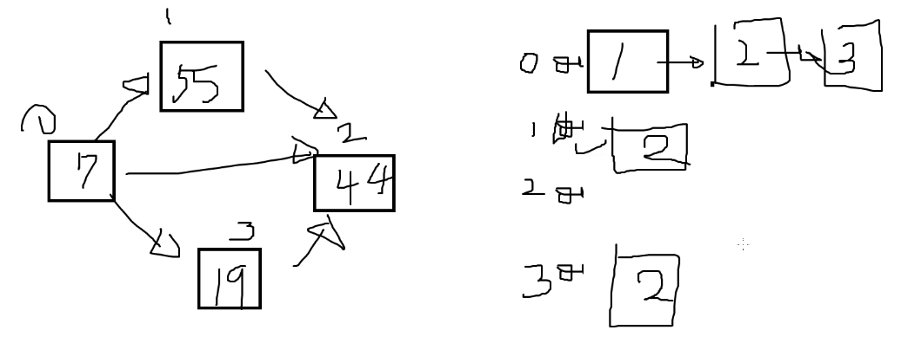

# 자료구조를 왜 배우냐?
자료구조를 안 배우면 다 배열에 밀어 넣는데, 배우면 어디에 저장할지 선택의 힘이 생긴다.

# 링크드 리스트
자료를 저장하는 최소의 칸을 자료구조에서 노드라고 부른다.
링크드리스트에서는 다음 노드가 누구냐도 노드에 저장한다.

# 그래프
링크드 리스트 다음 자료구조.
그래프가 저장하는 값은
1. 노드 값
2. 노드 관계

값만 저장하면 배열이면 충분하지만 관계도 저장하고 싶은 것. 그래서 그래프라는 자료구조에 저장한다. 노드끼리의 관계도 저장할 필요가 있을 때.

자료구조에서는 탐색이 기본이다. 링크드 리스트 탐색은 for문으로 구현한다.
그래프는 for문으로 탐색하기 어렵다. 순차적이지 않고 왔다갔다한다.
탐색하는 알고리즘이 따로 있는데, 그것을 DFS, BFS라고 부른다.

코테 문제가 뭔가 그래프스럽게 생겼다면 무슨 생각을 해야하느냐, 그래프 문제니까 탐색해서 지지고 볶고 하겠구나, DFS BFS 써야겠구나 라고 생각하면 된다.
그래프 기본 알고리즘이 DFS BFS다.

배열에서는 for문이 기본인것처럼, 그래프에서는 DFS BFS가 기본이다.
별거 아니거 그냥 탐색 하는 것이다. 거기서 뭘 할지는 코드를 잘 넣으면 된다.

DFS 와 BFS 는 탐색하는 순서가 다르다. for 문 탐색할 때 끝 인덱스에서부터 찾냐, 앞 인덱스에서 찾냐 처럼.
시간 제한이 없다면 모든 문제는 DFS로도 풀 수 있지만, 사악한 문제는 BFS로 풀지 않으면 시간초과가 나는 문제들이 있다.
그래서 문제마다 DFS와 BFS 중 속도가 어느게 더 빠르냐 차이 나는 것들이 있다.

DFS는 재귀로 구현한다.
BFS는 while 돌려서 큐를 사용해 구현한다.

## 그래프 초기화 방법
1. 인접 행렬
2. 인접 리스트

## 그래프 탐색 방법
1. DFS
2. BFS

4가지를 조합해서 문제를 풀면 된다. 이 네가지는 손에 익도록 연습해야한다.
그래프 초기화를 배열 초기화처럼, 그래프 탐색을 배열 탐색처럼 하는 것 마냥 연습 하면 된다.
(그래프 현업에서 지도 만드는 회사 아니면 잘 안 쓴단다, 전투력 측정용)

### 그래프 노드 값과 번호 구분을 잘 해야한다
번호는 중복된 숫자가 있으면 안되고, 값은 중복된 숫자가 있어도 된다.
노드 번호는 맘대로 지정해도 된다. (왜지?)

### 하드코딩 방법
문제가 주어졌을 때 우리가 먼저 해야할 것은 하드코딩이다.
#### 1. 인접 행렬 방법
    - adj [ i ][ j ] -> i번에서 j번으로 가는 것을 체크
    - 하드코딩 휴먼에러 꼭 조심할 것, 방지를 위해 두번 보자
    - 값 넣는 방법: 인접 행렬에 넣는게 아니라 행렬을 하나 더 만들어야 한다. --> 가중치 행렬
> adj [5][5], arr[5] --> 인접 행렬과 가중치 행렬 두개
```cpp
int arr[5][5] = {
    0,0,0,0,1,
    0,0,1,1,0,
    1,0,0,0,0,
    0,0,1,0,0,
    0,0,0,0,0,
};

int value[5] = {1, 3, 5, 1, 7};
```
#### 2. 인접 리스트 방법
링크드 리스트 배열로 나타낸다. (다음 링크를 나타내는 값의 순서는 상관 없다. 무작위로 들어있어도 된다.)

```cpp
arr[0] = {1, 2, 3};
arr[1] = {2};
arr[2] = {2};
```

array 보다는 vector로 저장하는게 더 편하다.

> 링크드 리스트를 작성하고, for 문으로 번호 출력하기
```cpp
#include <iostream>
#include <vector>
using namespace std;

vector<vector<int>> LL(5);

int main() {
	LL[0] = { 3 };
	LL[1] = { 2, 0 };
	LL[2] = { };
	LL[3] = { 4, 2 };
	LL[4] = { 2 };

	for (int i = 0; i < 5; i++) {
		for (int j = 0; j < LL[i].size(); j++) {
			cout << LL[i][j] << " ";
		}
		cout << endl;
	}
}
```
> 위의 링크드 리스트에서 노드 번호를 입력받고, 연결된 노드 번호들 출력하기
```cpp
int n;
cin >> n;

for (int i = 0; i < LL[n].size(); i++) {
    cout << LL[n][i] << " ";
}
```
> 링크드 리스트에서 DFS 사용하기
```cpp
#include <iostream>
#include <vector>
using namespace std;

vector<vector<int>> LL(5);

void run(int now) {
	cout << now;

	// 다음 갈 곳을 찾아라
	// 이미 다 저장되어 있기 때문에 if문으로 가지치기 해주지 않아도 된다. (싸이클이 없다면)
	for (int i = 0; i < LL[now].size(); i++) {
		int next = LL[now][i];
		run(next);
	}
}

int main() {
	LL[0] = { 3 };
	LL[1] = { 2, 0 };
	LL[2] = { };
	LL[3] = { 4, 2 };
	LL[4] = { 2 };

	run(0);
}
```


> **`인접 행렬`은 노드의 개수가 10,000개가 넘어가면, 100,000,000개의 공간을 차지하므로 약 400MB를 넘어간다. 이는 일반적인 코딩 테스트에서 제시하는 256MB 공간 제한을 넘긴다. 따라서 노드의 수가 많을 때에는 `링크드 리스트`를 사용해야 한다.**

### DFS
> main 함수의 for 문과 run 함수의 for문 구조는 같다.
```cpp
int adj[6][6] = {
	0, 1, 1, 0, 0, 0,
	0, 0, 0, 1, 1, 0,
	0, 0, 0, 0, 0, 1, // 나머지는 다 0 된다
};

char val[6] = { 'A', 'B', 'T', 'R', 'V', 'G' };

void run(int now) {
	// 다음 갈 곳 탐색
	for (int i = 0; i < 6; i++) {
		if (adj[now][i] == 0) continue;
		run(i);
	}
}

int main() {
	int n = 1;
	for (int i = 0; i < 6; i++) {
		if (adj[n][i]) {
			cout << i << " ";
		}
	}

	run(0);
}
```

### `used` 지우기 여부 여부
> 총 가짓수를 구해라: Trace Back 하면서 `used[i]` 값 지우기
> 갈 수는 있느냐: `used[i]` 지울 필요 없음
```cpp
void run(int now) {
	cout << now;
	for (int i = 0; i < 4; i++) {
		if (adj[now][i] == 0) continue;
		if (used[i] == 1) continue;
		used[i] = 1;
		run(i);
		used[i] = 0; // 있는거랑 없는거랑 차이
		// 안 지우면 연결된 node 를 1회씩만 모두 탐색한다.
		// 지우면 모든 경로를 탐색한다.
	}
}
```

**28레벨 6번, 깊이 우선 탐색 출력**
```cpp
char name[10];
int map[10][10];
int n;

void run(int now) {
	cout << name[now]; // 위에서 아래로 내려갈 때만 출력하게 된다

	for (int i = 0; i < 8; i++) {
		if (map[now][i] == 1) {
			run(i);
			// 이 부분은 트레이스 백 할 때
		}
	}
}

void input() {
	cin >> name;
	for (int i = 0; i < 8; i++) {
		for (int j = 0; j < 8; j++) {
			cin >> map[i][j];
		}
	}
}

int main() {
	input();
	run(0);
}
```

**최소 이동 네비게이션 (29레벨 2번)**
```cpp
#include <iostream>
using namespace std;

int adj[7][7] = {
   // 0 1 2 3 4 5 6
/*0*/ 0,0,0,0,0,0,0,
/*1*/ 0,0,0,1,0,1,1,
/*2*/ 0,1,0,0,1,0,0,
/*3*/ 0,0,0,0,0,1,0,
/*4*/ 0,1,0,0,0,0,0,
/*5*/ 0,1,0,0,0,0,0,
/*6*/ 0,0,0,0,0,0,0
};

int a, b;
int min_val = 21e8;
int visited[7]; // visited가 없으면 순환함

void run(int now, int lev) {
	if (now == b) {
		if (lev < min_val) min_val = lev;
		return;
	}

	for (int i = 1; i <= 6; i++) {
		if (adj[now][i] == 0) continue;
		if (visited[i] == 1) continue;
		cout << "현재: " << now << " 이후: " << i << endl;
		visited[i] = 1;
		run(i, lev + 1);
		cout << i << " 에서 돌아감" << endl;
		visited[i] = 0; // visited[i]를 지워주지 않으면 경로 하나만 탐색함
	}
}

int main() {
	cin >> a >> b;
	run(a, 0);
	cout << min_val;
}
```

## 가중치 DFS
```cpp
#include <iostream>
using namespace std;

int arr[4][4] = {
    0,50,60,300,
    0,0,7,0,
    30,0,0,10,
    0,0,0,0,
};
int used[4];
int mini = 21e8;

void run(int now, int sum) {

    if (now == 3) {
        cout << sum << " " ;
        if (mini > sum) mini = sum;
        return;
    }

    for (int i = 0; i < 4; i++) {
        if (arr[now][i] == 0) continue;
        if (used[i] == 1) continue;
        used[i] = 1;
        run(i, sum + arr[now][i]);
        used[i] = 0;
    }
}

int main() {

    used[0] = 1;
    run(0, 0);
    cout << "\n최소 : ";
    cout << mini;

    return 0;
}
```