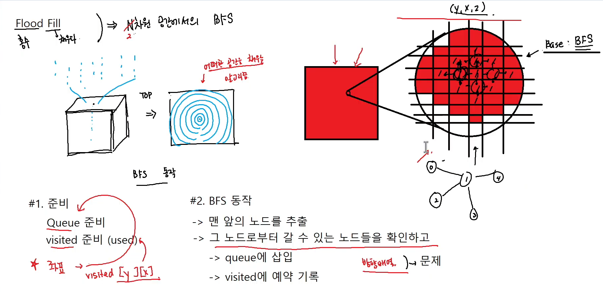

# Flood Fill
홍수처럼 옆 공간을 채워나가는 알고리즘
**Flood Fill 은 BFS 기반이다. N 차원(대부분 2차원) 에서의 BFS다.**
(BFS 준비: `Queue` 준비, `visited` 준비 필요)
## BFS 와 Flood Fill 의 차이
**노드 번호가 아니라 (y, x, z)가 필요함**
따라서 visited가 1차원이 아니라 2차원 `visited[y][x]`가 필요하다.
또한 갈 수 있는 방향을 확인할 때 `방향 배열`이 필요하다.
방향배열(퍼져 나가는 방향은 문제에서 주어진다.


BFS는 노드에서 노드 까지이고, Floor Fill 은 특정 좌표에서 다른 모든 특정 좌표까지의 최단 경로와 시간을 찾을 수 있는 알고리즘

## Flood Fill 기본 코드
```cpp
#include <iostream>
#include <queue>
using namespace std;

int y;
int x;

struct Node {
	int y; // y좌표
	int x; // x좌표
};

void bfs(int y, int x) {
	// #1. queue 준비
	queue<Node> q; // 얘는 왜 넣어준거지?
	q.push( {y, x} ); // Node 구조에 맞게 넣어주기
	
	// #2. visited 준비
	int visited[5][5] = {0,};
	visited[y][x] = 1; // 시작 노드 방문 기록

	// #3. 방향 배열 (상 하 좌 우)
	int ydir[] = { -1, 1, 0, 0 };
	int xdir[] = { 0, 0, -1, 1 };

	// #4. BFS 동작 (Flood Fill)
	while (!q.empty()) {
		// queue (대기열의) 맨 앞에 있는 노드를 추출
		Node now = q.front();
		q.pop();

		// now로 부터 갈 수 있는 노드들을 확인하고, queue에 삽입
		// 갈 수 있는 방향 -> 문제에서 주어진다 -> 상하좌우로 퍼진다
		for (int i = 0; i < 4; i++) {
			// 다음 갈 수 있는 좌표를 일단 본다.
			int ny = now.y + ydir[i];
			int nx = now.x + xdir[i];

			//  범위 체크 무조건 #1
			if (ny < 0 || nx < 0 || ny >= 5 || nx >= 5) continue;
			// (ny, nx)가 이미 방문했거나, 방문이 예약된 상태라면
			if (visited[ny][nx] == 1) continue;

			// 내가 (ny, nx) 를 갈 수 있다는게 확정됐다면
			// 방문 기록 (예약)
			visited[ny][nx] = 1;
			q.push({ ny, nx });
		}
	}

	// -- while이 끝나면 -- visited가 다 채워진 상태
	for (int i = 0; i < 5; i++) {
		for (int j = 0; j < 5; j++) {
			cout << visited[i][j] << " ";
		}
		cout << endl;
	}
}

int main() {
	cin >> y >> x;
	// bfs(시작노드)
	bfs(y, x);
}
```
## 횟수 출력 코드
```cpp
#include <iostream>
#include <queue>
using namespace std;

int y;
int x;

struct Node {
	int y; // y좌표
	int x; // x좌표
};

void bfs(int y, int x) {
	// #1. queue 준비
	queue<Node> q; // 얘는 왜 넣어준거지?
	q.push( {y, x} ); // Node 구조에 맞게 넣어주기
	
	// #2. visited 준비
	int visited[5][5] = {0,};
	visited[y][x] = 1; // 시작 노드 방문 기록

	// #3. 방향 배열 (상 하 좌 우)
	int ydir[] = { -1, 1, 0, 0 };
	int xdir[] = { 0, 0, -1, 1 };

	// #4. BFS 동작 (Flood Fill)
	while (!q.empty()) {
		// queue (대기열의) 맨 앞에 있는 노드를 추출
		Node now = q.front();
		q.pop();

		// now로 부터 갈 수 있는 노드들을 확인하고, queue에 삽입
		// 갈 수 있는 방향 -> 문제에서 주어진다 -> 상하좌우로 퍼진다
		for (int i = 0; i < 4; i++) {
			// 다음 갈 수 있는 좌표를 일단 본다.
			int ny = now.y + ydir[i];
			int nx = now.x + xdir[i];

			//  범위 체크 무조건 #1
			if (ny < 0 || nx < 0 || ny >= 5 || nx >= 5) continue;
			// (ny, nx)가 이미 방문했거나, 방문이 예약된 상태라면
			if (visited[ny][nx] != 0) continue;

			// 내가 (ny, nx) 를 갈 수 있다는게 확정됐다면
			// 방문 기록 (예약)
			// 다음 좌표까지의 경로 = 현재 위치까지의 경로에서 +1번 더 퍼져나간 경로
			visited[ny][nx] = visited[now.y][now.x] + 1;
			q.push({ ny, nx });
		}
	}

	// -- while이 끝나면 -- visited가 다 채워진 상태
	for (int i = 0; i < 5; i++) {
		for (int j = 0; j < 5; j++) {
			cout << visited[i][j] - 1 << " ";
		}
		cout << endl;
	}
}

int main() {
	cin >> y >> x;
	// bfs(시작노드)
	bfs(y, x);
}
```

## 용사의 보스 찾기 코드
```cpp
#include <iostream>
#include <queue>
using namespace std;

int y;
int x;
int by;
int bx;
string MAP[5];

struct Node {
	int y; // y좌표
	int x; // x좌표
};

void bfs(int y, int x) {
	// #1. queue 준비
	queue<Node> q; // 얘는 왜 넣어준거지?
	q.push({ y, x }); // Node 구조에 맞게 넣어주기

	// #2. visited 준비
	int visited[5][5] = { 0, };
	visited[y][x] = 1; // 시작 노드 방문 기록

	// #3. 방향 배열 (상 하 좌 우)
	int ydir[] = { -1, 1, 0, 0 };
	int xdir[] = { 0, 0, -1, 1 };

	// #4. BFS 동작 (Flood Fill)
	while (!q.empty()) {
		// queue (대기열의) 맨 앞에 있는 노드를 추출
		Node now = q.front();
		q.pop();

		// now로 부터 갈 수 있는 노드들을 확인하고, queue에 삽입
		// 갈 수 있는 방향 -> 문제에서 주어진다 -> 상하좌우로 퍼진다
		for (int i = 0; i < 4; i++) {
			// 다음 갈 수 있는 좌표를 일단 본다.
			int ny = now.y + ydir[i];
			int nx = now.x + xdir[i];

			//  범위 체크 무조건 #1
			if (ny < 0 || nx < 0 || ny >= 5 || nx >= 5) continue;
			// (ny, nx)가 이미 방문했거나, 방문이 예약된 상태라면
			if (visited[ny][nx] != 0) continue;
			// 내가 지금 가려는 곳이 벽이라면
			if (MAP[ny][nx] == '#') continue;

			// 내가 (ny, nx) 를 갈 수 있다는게 확정됐다면
			// 방문 기록 (예약)
			// 다음 좌표까지의 경로 = 현재 위치까지의 경로에서 +1번 더 퍼져나간 경로
			visited[ny][nx] = visited[now.y][now.x] + 1;
			q.push({ ny, nx });
		}
	}

	// -- while이 끝나면 -- visited가 다 채워진 상태
	for (int i = 0; i < 5; i++) {
		for (int j = 0; j < 5; j++) {
			cout << visited[i][j] - 1 << " ";
		}
		cout << endl;
	}
	cout << "정답 : " << visited[by][bx] - 1;
}

int main() {

	for (int i = 0; i < 5; i++) {
		cin >> MAP[i];
	}

	cin >> y >> x;
	// bfs(시작노드)
	
	// bfs(시작좌표) -> bfs(y, x);
	cin >> by >> bx;
	bfs(y, x);
}
```

## 무기찾고 보스 물리치기 코드
```cpp
#include <iostream>

#include <queue> 
using namespace std;

int sy; 
int sx; 
int by; 
int bx; 
int my;
int mx; 

string MAP[5]; 
int dist = 0; 

struct Node {
    int y; // y좌표 
    int x; // x좌표 
};

void bfs(int y, int x, int dy, int dx) {
    // #1. queue 준비
    queue<Node>q;
    q.push({ y, x });

// #2. visited 준비
int visited[5][5] = { 0, }; 
visited[y][x] = 1; // 시작 노드 방문 기록 

// #3. 방향 배열 
int ydir[] = { -1, 1, 0, 0 };
int xdir[] = { 0, 0, -1, 1 };

// #4. BFS 동작 (flood fill) 
while (!q.empty()) {
    // queue (대기열의) 맨 앞에 있는 노드를 추출 
    Node now = q.front();
    q.pop(); 

    // now로 부터 갈 수 있는 노드들을 확인하고, 그리고 queue에 삽입 
    // 갈 수 있는 방향 -> 문제에서 주어진다 -> 상하좌우로 퍼진다
    for (int i = 0; i < 4; i++) {
        // 다음 갈 수 있는 좌표를 일단 본다.
        int ny = now.y + ydir[i]; 
        int nx = now.x + xdir[i];

        // 범위 체크 무조건 #1 
        if (ny < 0 || nx < 0 || ny >= 5 || nx >= 5)
            continue; // 여기는 못간다

        // (ny, nx) 이미 방문했거나, 방문이 예약된 상태라면 
        if (visited[ny][nx] != 0)
            continue; 

        // if (내가 지금 갈려고하는 곳이 벽이라면)
        if(MAP[ny][nx] == '#')
            continue; 

        // --- 내가 (ny, nx)를 갈 수 있다! 라는게 확정
        // 방문 기록 (예약)
        // 다음 좌표까지의 경로 = 현재 위치까지의 경로에서 +1번 더 퍼져나간 경로
        visited[ny][nx] = visited[now.y][now.x] + 1; 
        q.push({ ny, nx }); 
    }
}
/*
// -- while이 끝나면 -- visited가 다 채워진 상태 
for (int i = 0; i < 5; i++) {
    for (int j = 0; j < 5; j++) {
        cout << visited[i][j]-1 << " ";
    }
    cout << '\n';
}
cout << "정답 : " << visited[by][bx] - 1;
*/
dist += visited[dy][dx] - 1; 
}

void bfs2(int y, int x) {
    // #1. queue 준비
    queue<Node>q;
    q.push({ y, x });

// #2. visited 준비
int visited[5][5] = { 0, };
visited[y][x] = 1; // 시작 노드 방문 기록 

// #3. 방향 배열 
int ydir[] = { -1, 1, 0, 0 };
int xdir[] = { 0, 0, -1, 1 };

// #4. BFS 동작 (flood fill) 
while (!q.empty()) {
    // queue (대기열의) 맨 앞에 있는 노드를 추출 
    Node now = q.front();
    q.pop();
    for (int i = 0; i < 4; i++) {
        // 다음 갈 수 있는 좌표를 일단 본다.
        int ny = now.y + ydir[i];
        int nx = now.x + xdir[i];

        // 범위 체크 무조건 #1 
        if (ny < 0 || nx < 0 || ny >= 5 || nx >= 5)
            continue; // 여기는 못간다
        if (visited[ny][nx] != 0)
            continue;
        if (MAP[ny][nx] == '#')
            continue;
        visited[ny][nx] = visited[now.y][now.x] + 1;
        q.push({ ny, nx });
    }
}
for (int i = 0; i < 5; i++) {
    for (int j = 0; j < 5; j++)
        cout << visited[i][j] << " ";
    cout << '\n';
}

cout << visited[sy][sx] - 1<< '\n';
cout << visited[by][bx] - 1 << '\n';

// 무기 -> 캐릭터 
dist += visited[sy][sx]-1; 
// 무기 -> 보스
dist += visited[by][bx]-1;
}

int main() {

for (int i = 0; i < 5; i++) {
    cin >> MAP[i]; 
}

cin >> sy >> sx; 
// bfs(시작 노드)
// bfs(시작 좌표) -> bfs(y, x); 

cin >> by >> bx; 
cin >> my >> mx; 

/*
bfs(y, x, my, mx);
bfs(my, mx, by, bx); 
*/ 

bfs2(my, mx); 

cout << dist;
}
```

## 몇개의 섬 코드
```cpp
#include <iostream>

#include <queue> 
using namespace std;

int sy, sx; 

string MAP[8] = {
    "####",
    "###_",
    "#___",
    "_###",
    "_###",
    "____",
    "##__",
    "#___"
};

struct Node {
    int y; // y좌표 
    int x; // x좌표 
};

// 단계별 floodfill 
/*
void bfs(int y, int x) {
    // #1. queue 준비
    queue<Node>q;
    q.push({ y, x });

// #2. visited 준비
int visited[5][5] = { 0, }; 
visited[y][x] = 1; // 시작 노드 방문 기록 

// #3. 방향 배열 
int ydir[] = { -1, 1, 0, 0 };
int xdir[] = { 0, 0, -1, 1 };

int day = 1; 
cout << "DAY #" << day << '\n';
for (int i = 0; i < 5; i++) {
    for (int j = 0; j < 5; j++) {
        cout << visited[i][j];
    }
    cout << '\n';
}

while (!q.empty()) {
    // 다음 날이 되었다! 
    day++; 

    // 지금 queue에서 오늘 날짜에 감염될 node 만큼만을 추출해서 기록
    int cursize = q.size(); 
    for (int j = 0; j < cursize; j++) {

        Node now = q.front();
        q.pop();

        for (int i = 0; i < 4; i++) {
            int ny = now.y + ydir[i];
            int nx = now.x + xdir[i];

            if (ny < 0 || nx < 0 || ny >= 5 || nx >= 5)
                continue; // 

            if (visited[ny][nx] == 1)
                continue;

            visited[ny][nx] = 1;
            q.push({ ny, nx });
        }
    }

    cout << "DAY #" << day << '\n';
    for (int i = 0; i < 5; i++) {
        for (int j = 0; j < 5; j++) {
            cout << visited[i][j];
        }
        cout << '\n';
    }
    cout << '\n';
}
}
*/ 

int cnt = 0; 
// visited를 여러번의 flood fill에서 공유할수 있도록 함
int visited[8][8] = { 0, };

void bfs(int y, int x) {
    // #1. queue 준비
    queue<Node>q;
    q.push({ y, x });

// #2. visited 준비
visited[y][x] = 1; // 시작 노드 방문 기록 

// #3. 방향 배열 
int ydir[] = { -1, 1, 0, 0 };
int xdir[] = { 0, 0, -1, 1 };

while (!q.empty()) {

    Node now = q.front();
    q.pop();

    for (int i = 0; i < 4; i++) {
        int ny = now.y + ydir[i];
        int nx = now.x + xdir[i];

        if (ny < 0 || nx < 0 || ny >= 8 || nx >= 8)
            continue; // 

        if (visited[ny][nx] == 1)
            continue;
        
        // 연결된 섬이라면 -> 계속
        if (MAP[ny][nx] == '_')
            continue; 

        visited[ny][nx] = 1;
        q.push({ ny, nx });
    }
}
}

int main() {
    for (int i = 0; i < 8; i++) {
        for (int j = 0; j < 8; j++) {
            // 만약 이 위치가 섬이라면 && 아직 확인하지 않은 섬이라면
            if (MAP[i][j] == '#' && visited[i][j] == 0) {
                bfs(i, j); 
                // 한번의 플러드필이 종료된다면 -> 하나의 연결된 섬을 찾았다!
                cnt++; 
            }
        }
    }
    cout << cnt;
}
```

## 1953. 탈주범 검거
```cpp
#define _CRT_SECURE_NO_WARNINGS
#include <iostream>
#include <cstring>
#include <vector>
#include <queue> 
using namespace std;

// SWEA : 탈주범 검거

/*
2
5 6 2 1 3
0 0 5 3 6 0
0 0 2 0 2 0
3 3 1 3 7 0
0 0 0 0 0 0
0 0 0 0 0 0
5 6 2 2 6
3 0 0 0 0 3
2 0 0 0 0 6
1 3 1 1 3 1
2 0 2 0 0 2
0 0 4 3 1 1
*/

int N; // 세로 크기
int M; // 가로 크기
int R; // 맨홀의 세로 위치 (y) 
int C; // 맨홀의 가로 위치 
int L; // 소요시간
int MAP[50][50]; 

// 파이프가 연결하는 방향에 대한 정보를 담는 dir
int pipedir[][4] = {
    // 상하좌우
    // 갈 수있으면 1, 아니면 0
    {0, 0, 0, 0},
    {1, 1, 1, 1}, // +
    {1, 1, 0, 0},
    {0, 0, 1, 1},
    {1, 0, 0,1 },
    {0, 1, 0, 1},
    {0, 1, 1, 0},
    {1, 0, 1, 0}
};

struct Node {
    int y;
    int x; 
};

// 무지성 flood fill 
// 이제 추가해야 되는 조건 
// #1. 파이프 
// --> 내가 지금 파이프에서 다음 파이프로 갈수 있는가? 
// #2. L만큼의 시간동안 퍼진다. 
// --> 단계별 flood fill

int bfs(int y, int x) {
    // queue 준비
    queue<Node>q; 
    q.push({ y, x });

    // visited 준비
    int visited[50][50] = { 0, };
    visited[y][x] = 1; 

    // 방향 배열
    int ydir[] = { -1, 1, 0, 0 };
    int xdir[] = { 0, 0, -1, 1 }; 

    int time = 0; 
    int cnt = 0; // 내가 방문한 파이프의 개수

    while (!q.empty()) {
        // 어느 순간 내가 L의 시간 만큼 지낸 때가 온다. 
        if (time == L)
            break; 

        // 여기 돌아오면 -> 하나의 단계가 완료
        // -> 1시간이 지났다 
        time++; 

        // 일단은 단계별로 -> 지금 queue에 들어있는 만큼만
        // 돌아갈 수 있도록 구성

        int cursize = q.size();
        for (int j = 0; j < cursize; j++) {

            // now -> 내가 지금 진입한 파이프 
            // now = 지금 내가 갈 수 있는 파이프
            // now가 나왔다는 것 = 내가 갈수 있는 파이프가 하나 늘었다!
            Node now = q.front();
            q.pop();

            cnt++; 

            for (int i = 0; i < 4; i++) {
                int ny = now.y + ydir[i];
                int nx = now.x + xdir[i];
                if (ny < 0 || nx < 0 || ny >= N || nx >= M)
                    continue;
                if (visited[ny][nx] == 1)
                    continue;

                // 갈수 있는지 판단
                // #1. 지금 내 파이프가 i번 방향으로 갈수있는가? 
                int curpipe = MAP[now.y][now.x]; // 지금 내 파이프 번호 
                // 만약 지금 내 파이프에서 i번째 방향으로 못간다면 continue
                if (pipedir[curpipe][i] == 0)
                    continue; 

                // #2. 벽이면 못간다
                if (MAP[ny][nx] == 0)
                    continue;

                // #3. 지금 내가 (ny, nx) 파이프로 가려고하는데
                // 여기까지 왔다는건 다음 위치가 벽도 아니고
                // 지금 나는 이 방향으로 갈 수 있다 
                // --> 다음 파이프가 내가 지금 행하는 방향에서
                // 왔을때 -> 들어갈수 있는가? 
                int nextpipe = MAP[ny][nx]; 
                // 다음 파이프가 지금 파이프에서 가는 방향의
                // 반대방향이 뚫려있는가? 
                // 내가 지금 가는 i방향의 반대방향을 확인
                int nextdir = -1;
                if (i % 2 == 0)
                    nextdir = i + 1;
                else
                    nextdir = i - 1; 
                if (pipedir[nextpipe][nextdir] == 0)
                    continue; 

                visited[ny][nx] = 1;
                q.push({ ny, nx });
            }
        }
    }
    return cnt; 
}

int main() {

    freopen("input.txt", "r", stdin);
    int T;
    cin >> T;
    for (int tc = 1; tc <= T; tc++) {
        // reset
        memset(MAP, 0, sizeof(MAP));

        // input
        cin >> N >> M >> R >> C >> L; 
        for (int i = 0; i < N; i++) 
            for (int j = 0; j < M; j++)
                cin >> MAP[i][j]; 
        
        // solve
        int ans = bfs(R, C); 
        
        // output
        cout << "#" << tc << " " << ans << '\n';
    }
}
```