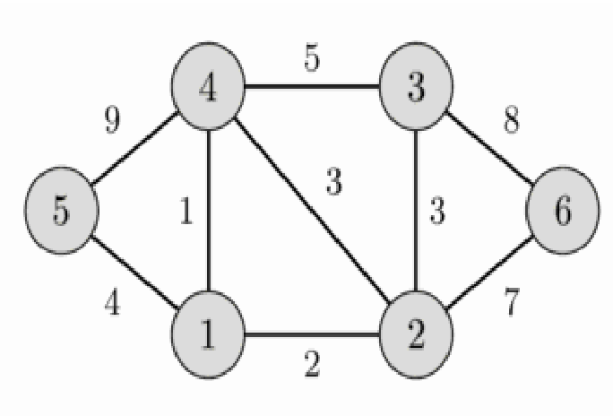
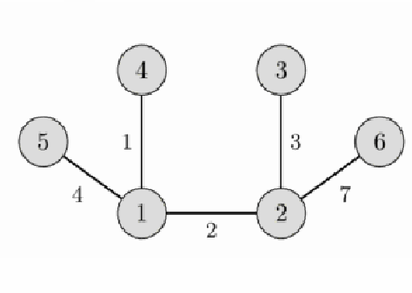

# MST

문제 이미지



```cpp
#include<iostream>
#include<vector>
#include<algorithm>
using namespace std;

struct Edge
{
    int a, b; 
    int cost; 
};
int N, T; 
vector<Edge> edge_lst;
bool cmp(Edge& left, Edge& right)
{
    return left.cost < right.cost; 
}
void input()
{
    cin >> N >> T; 
    for (int t = 0; t < T; t++)
    {
        int a, b, cost; 
        cin >> a >> b >> cost; 
        edge_lst.push_back({ a,b,cost }); // 무향 그래프 
    }
}

int parent[100]; 
void init()
{
    for (int node = 1; node <= N; node++)
    {
        parent[node] = node; 
    }
}
int Find(int now)
{
    if (parent[now] == now)
        return now; 
    int ret = Find(parent[now]); 
    parent[now] = ret; 
    return ret; 
}
void Union(int a, int b)
{
    int ra = Find(a); 
    int rb = Find(b); 
    if (ra == rb) return; 
    parent[rb] = ra; 
}
int main()
{
    // 1. 간선리스트 저장하기 
    input(); 
    init(); 
    // 2. 비용이 적은거부터 고를 수 있도록 
    sort(edge_lst.begin(), edge_lst.end(),cmp);

    int sum = 0; 
    for (int i = 0; i < edge_lst.size(); i++)
    {
        // edge 를 MST 에 포함할지말지 -> Union Find 로 작성하기 
        if (Find(edge_lst[i].a) == Find(edge_lst[i].b))
            continue;  // MST에 해당 간선 포함 X

        Union(edge_lst[i].a, edge_lst[i].b); // MST에 포함시키기 
        sum += edge_lst[i].cost; 
    }
    cout << sum; 

    return 0; 
}
```