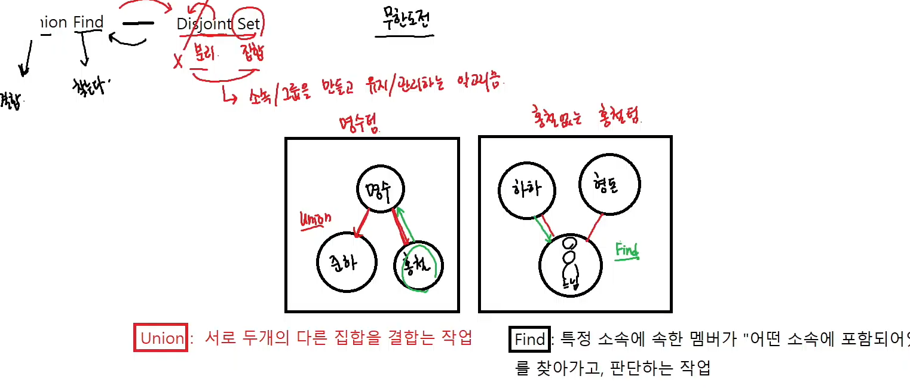
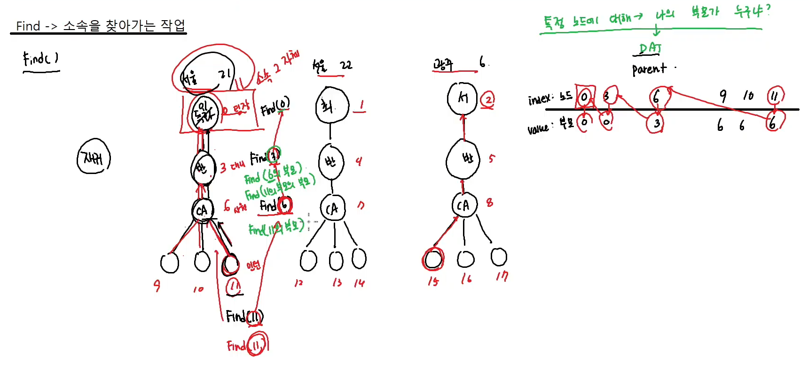
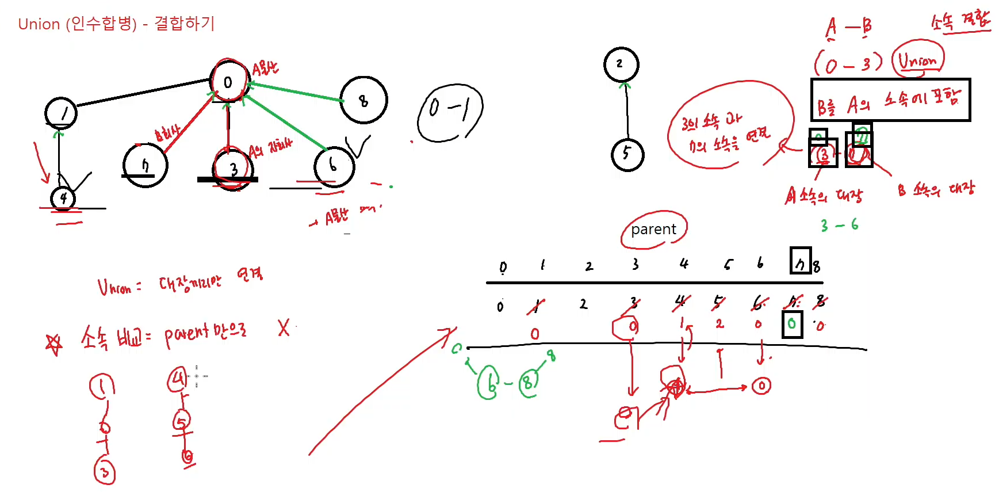

# Union Find
`Union` : 서로 다른 두개의 다른 집합을 결합하는 작업
`Find` : 특정 소속에 속한 멤버가 어떤 소속에 포함되어 있는지를 찾아가고 판단하는 작업



Find의 시간복잡도는 O(N) (모든 노드가 수직으로 이루어져있는 경우)

O(N) 정도면 느리기 때문에
Find를 최적화한 것이
`Path Compression (경로 압축)`

**Find 코드**
```cpp
#include <iostream>
#include <algorithm>
#include <vector>
#include <queue>
using namespace std;

int parent[20];
int N, M;

int Find(int now) {
	if (now == parent[now]) return now;

	return Find(parent[now]);
}

int main()
{
	cin >> N >> M;

	for (int i = 0; i < N; i++) {
		parent[i] = i;
	}

	for (int i = 0; i < M; i++) {
		int A, B;
		cin >> A >> B;
		parent[A] = B;
	}

	int num;
	cin >> num;
	cout << num << " 의 소속은 : " << Find(num);
}
```

Find의 시간복잡도 : O(N)
경로 압축 후의 Find의 시간 복잡도 : O(A(N)) (O의 애크먼의 N, O(1)과 O(logN) 사이)

장점: 시간의 효율성이 대폭 상승한다.
단점: 돌이킬 수 없다.

**Find 유튜브 코드**
```cpp
#include <iostream>
using namespace std;
/*
// A의 부모는 B다 
18 15
3 0 
6 3 
9 6
10 6
11 6
4 1
7 4
12 7
13 7
14 7
5 2
8 5
15 8
16 8
17 8
*/
// Find : 소속을 찾아가는 알고리즘 
// #1. 정보 (부모 정보)를 저장할 parent가 필요
int parent[101]; 
int N, M;
// Find의 시간복잡도 : O(N)
// 경로 압축 후의 Find의 시간복잡도 : O(A(N))
// 장점 : 시간의 효율성의 대폭 상승한다
// 단점 : 돌이킬수가 없음
int Find(int now) {
    // 종료 조건 
    // now의 부모가 나랑 같다면 -> 소속을 찾았다!
    if (now == parent[now])
        return now;
    cout << now << "의 부모 : " << parent[now] << "\n";
    
    // 재귀 구성
    // 내가 대장이 아니면 -> 나의 부모를 찾아가라!
    // path compresssion 
    // 돌아왔을떄-> 소속을 "아는 상태"로 가지고 돌아오니까
    // 나의 부모(소속)은 = 돌아올때 가지고 있던 값이다 
    return parent[now] = Find(parent[now]); 
}
int main() {
    // cin >> N >> M;
    // parent는 항상 자기 자신이 대장이다! 
    // 즉, 본인은, 개별적인 노드이다! 라는 상태에서 시작
    for (int i = 0; i < N; i++)
        parent[i] = i; // 나의 부모는 나다! 
    //for (int i = 0; i < M; i++) {
    //    int A, B;
    //    cin >> A >> B;
    //    // A의 부모는 B다 
    //    parent[A] = B; 
    //}
    for (int i = 0; i < 100; i++)
        parent[i + 1] = i; 
    int num;
    cin >> num;
    cout << num << " 의 소속은 : " << Find(num) << '\n'; 
    cout << "=======\n";
    cout << num << " 의 소속은 : " << Find(num);
    cout << '\n';
    for (int i = 0; i < 100; i++)
        cout << parent[i] << " ";
}
```

# 유니온


A와 B가 같은 그룹인가?
절대 현재 parent의 상황으료 비교하면 안된다.
한 번 더 업데이트를 해줘야 한다.
`if (Find(a) == Find(b))`
A의 대표를 다시 한번 찾아가면서 parent를 업데이트
--> 상위 노드에 대한 path compression

**유튜브 코드**
```cpp
#include <iostream>
using namespace std;
/*
// 9개의 노드, 6개의 결합 정보 
9 7 
0 3
3 6
6 8
3 7
1 4
2 5
4 3 
*/
// Find : 소속을 찾아가는 알고리즘 
// #1. 정보 (부모 정보)를 저장할 parent가 필요
int parent[101]; 
int N, M;
// 개발자 수 정보
int pop[101]; 
int Find(int now) {
    if (now == parent[now])
        return now;
    return parent[now] = Find(parent[now]); 
}
void Union(int A, int B) {
    // #1. 각 A와 B의 소속을 확인
    int pa = Find(A);
    int pb = Find(B);
    // 만약 A와 B가 이미 같은 소속이라면 아래 합병을 거치지 마라!
    if (pa == pb)
        return; // 함수 종료
    // #2. B의 소속을 A의 소속의 산하로 만든다!
    parent[pb] = pa;
    // 합병이 되면서, A회사가 B회사의 개발자를 10명 데려온다! 
    pop[A] += 10;
    pop[B] -= 10;
}
int main() {
    //cin >> N >> M;
    //// parent는 항상 자기 자신이 대장이다! 
    //// 즉, 본인은, 개별적인 노드이다! 라는 상태에서 시작
    //for (int i = 0; i < N; i++)
    //    parent[i] = i; // 나의 부모는 나다! 
    //// 소속 결합 정보 
    //for (int i = 0; i < M; i++) {
    //    // A와 B가 결합된다! 
    //    int A, B;
    //    cin >> A >> B;
    //    Union(A, B); 
    //}
    //int a, b;
    //cin >> a >> b;
    //// a와 b가 같은 그룹인가? 
    //// --> 절대 현재 parent의 상황으로 비교 X
    //// --> 한번 더 업데이트
    //// if (parent[a] == parent[b])
    //// -> A의 대표를 다시 한번 찾아가면서 parent를 update 
    //// --> A의 상위 노드에 대한 path compression
    //if(Find(a) == Find(b))
    //    cout << "같은 그룹";
    //else
    //    cout << "다른 그룹";
    // 문제
    // N개의 회사가 있습니다 (IT 회사)
    // 회사들이 경제가 안좋아서 망하면서 M개의 인수합병 과정을 밟아요
    // A가 B를 인수할때, A회사가 대표회사가 되고, 
    // B회사로부터 10명의 개발자들을 빼올겁니다. 
    // M개의 인수합병 과정을 거친 후, 각 회사에 몇 명의 개발자가 남아있는지를 출력 
    // input 
    /*
    6 5
    10 20 30 40 50 60
    0 1
    3 0
    3 4 
    4 3 
    2 5 
    */
    // output : 10 10 40 60 40 50
    cin >> N >> M;
    
    // parent 구성
    for (int i = 0; i < N; i++){
        parent[i] = i;
        int temp;
        cin >> temp;
        pop[i] = temp;
    }
    // 합병 정보
    for (int i = 0; i < M; i++) {
        // A와 B가 합병한다!
        int A, B; 
        cin >> A >> B;
        // Union을 하기 전에, 이런 문제에서는, 이미 결합된 소속을 다시 결합하면 문제가 생길 수 있다! 
        // #1. Union을 하기 전에 결합 여부 확인 
        if (Find(A) == Find(B))
            continue; // 이미 같은 소속이라면 결합하지 않아! 
        Union(A, B);
    }
    for (int i = 0; i < N; i++) {
        cout << i << " : " << pop[i] << '\n';
    }
}
```

**오프라인 Find, Union 구현 코드**
```cpp
int parent[10]; 
int de; 
int Find(int now)
{
    if (now == parent[now]) {
        return now;
    }
    int ret = Find(parent[now]);
    parent[now] = ret; // 경로압축
    return ret; 
}
void Union(int a, int b)
{
    int pa = Find(a); 
    int pb = Find(b); 
    if (pa == pb) return; // a 와 b 는 이미 같은 그룹 
    parent[pb] = pa; 
}
```

**Lv33. Cycle을 찾아라**
```cpp
#include<iostream>
#include<queue>
using namespace std;

char parent[200]; // 'A'(65) ~ 'Z'(90)
void init()
{
    for (char ch = 'A'; ch <= 'Z'; ch++)
    {
        parent[ch] = ch;
    }
}

char Find(char now)
{
    if (now == parent[now]) {
        return now; // root 
    }
    char ret = Find(parent[now]);
    parent[now] = ret; // 경로 압축 
    return ret;
}
void Union(char a, char b)
{
    char pa = Find(a);
    char pb = Find(b);
    if (pa == pb) return; 
    parent[pb] = pa; 
}
int main()
{
    init();
    int Q;
    cin >> Q;
    int found = 0;
    for (int q = 0; q < Q; q++)
    {
        char a, b;
        cin >> a >> b;
        if (Find(a) == Find(b))
        {
            found = 1;
        }
        Union(a, b);
    }
    if (found)
    {
        cout << "발견";
    }
    else
    {
        cout << "미발견";
    }
    return 0;
}
```