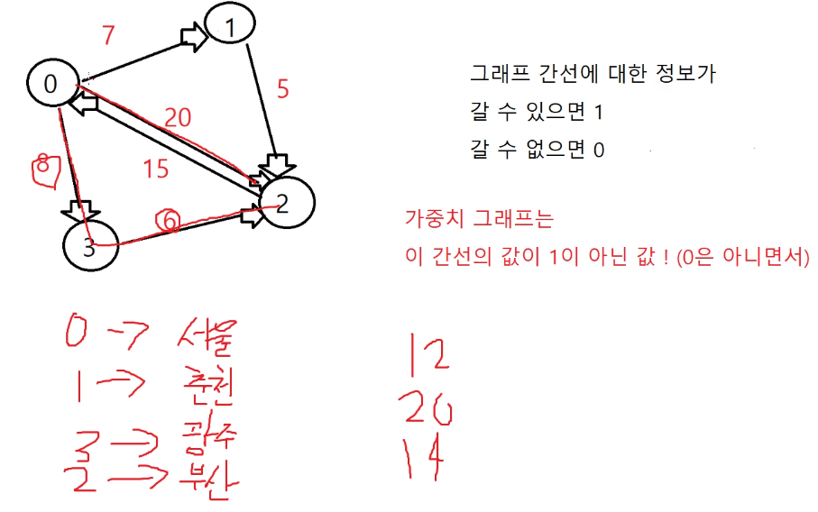

# 가중치 그래프
가중치 그래프는 간선의 값이 0이 아니면 0은 아니면서 1이 아닌 값


위의 그림에서 노드는 4개, 간선은 6개
<br> 

> 다른 노드들은 방문하지 않아서 12만 결과로 나옴
```cpp
int sum = 0;
int visited[4] = {0,};
// 0과 2가 싸이클이기 때문에 visited가 필요

// 인접행렬 map[노드개수][노드개수] 하드코딩
int map[4][4] = {
    0, 7, 20, 8,
    0, 0, 5, 0,
    15, 0, 0, 0,
    0, 0, 6, 0
};

void dfs(int now, int sum) 
{
    if(now == 2) // 2번 노드에 도착했다면
    {
        cout << sum << endl; // 총합 출력
        return;
    }

    for (int i = 0; i < 4; i++) 
    {
        if (map[now][i] == 0) continue;
        if (visited[i] == 1) continue; // visited[i]를 초기화해주지 않으면, 이 라인에 걸려서 한 경로만 출력됨
        visited[i] = 1;
        dfs(i, sum+map[now][i]);
    }
}

int main()
{
    visited[0] = 1; // 시작노드는 방문배열에 1을
    dfs(0, sum);
}
```
<br>

> 방문 가능한 모든 경로들의 합들을 출력
```cpp
int sum = 0;
int visited[4] = {0,};
// 0과 2가 싸이클이기 때문에 visited가 필요

// 인접행렬 map[노드개수][노드개수] 하드코딩
int map[4][4] = {
    0, 7, 20, 8,
    0, 0, 5, 0,
    15, 0, 0, 0,
    0, 0, 6, 0
};

void dfs(int now, int sum) 
{
    if(now == 2) // 2번 노드에 도착했다면
    {
        cout << sum << endl; // 총합 출력
        return;
    }

    for (int i = 0; i < 4; i++) 
    {
        if (map[now][i] == 0) continue;
        if (visited[i] == 1) continue;
        visited[i] = 1;
        dfs(i, sum+map[now][i]);
        visited[i] = 0; // visited 초기화
    }
}

int main()
{
    visited[0] = 1; // 시작노드는 방문배열에 1을
    dfs(0, sum);
}
```