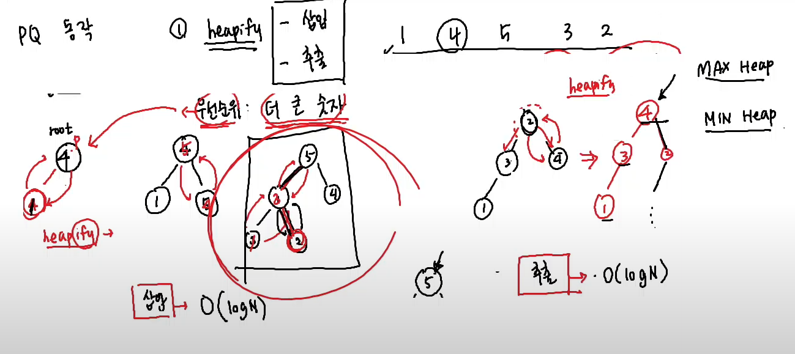

# 우선순위 큐 (Priority Queue)

**큐**(Queue) : 공정한 자료구조 (First In First Out)

**우선순위 큐**(Priority Queue) : 더 큰 숫자에 가중치를 두는 큐(우선순위, 새치기가 가능한 큐)




```cpp
#include <iostream>
#include <queue> // priority queue 포함
using namespace std;

struct Student {
    string name; // 이름
    int age; // 나이
    int grade; // 점수

    bool operator < (Student right) const {
        if (grade > right.grade) return false;
        if (grade < right.grade) return true;
        if (age > right.age) return false;
        if (age < right.age) return true;
        if (name < right.name) return false;
        if (name > right.name) return true;
        return false;
    }
}

struct ssafycmp {
    bool operator()(Student left, Student right) {
        if (left.grade > right.grade) return true;
        if (left.grade < right.grade) return false;
        if (left.age > right.age) return true;
        if (left.age < right.age) return false;
        if (left.name < right.name) return true;
        if (left.name > right.name) return false;
        return false;
    }
}

struct cmp {
    // PQ 에서 `<` 를 쓰면 Max HEAP
    // sort 때와 동일한 생각으로 기준을 잡는다면
    // 올바른 상황일 때 return false;
    bool operator()(int left, int right) {
        // return left < right;
        if (left > right) return true; // 우리가 원하는 상태
        if (left < right) return false; // 바뀌어야 하는 상태
        return false; // Stable
    }
}

int main()
{
    int arr[] = { 1, 4, 5, 3, 2 };
    priority_queue<int, vector<int>, less<int>> pq;
    // 삽입 : push()
    // 삭제 : pop()
    // 맨 위 (우선순위가 가장 높은 값) return : q.top()
    // 비어있는가? empty()

    for (int i = 0; i < 5; i++) {
        pq.push(arr[i]);
    }

    // 출력
    while (!pq.empty()) {
        cout << pq.top() << " ";
        pq.pop();
    }

    // #2. MIN Heap
    // priority_queue<typename, container, less>
    // typename : 자료형
    // container : vector
    // _Pr : less --> <
    // less : Compare cmp X --> 함수, 구조체
    // 함수로 넣어주고 안되고, 구조체 함수를 만들어서 넣어야 한다.
    // priority_queue<int, vector<int>, less<int>>

    // #3. 사용자 정의 heap
    priority_queue<Student, vector<Student>, ssafycmp> pq;

    // #1. 점수 높은 순
    // #2. 나이 많은 순
    // #3. 이름 사전
    pq.push({"송유빈", 3, 100});
    pq.push({"박준형", 4, 100});
    pq.push({"김택우", 2, 100});
    pq.push({"김기덕", 4, 100});
    pq.push({"이득화", 7, 25});

    while (!pq.empty()) {
        Student now = pq.top();
        cout << ssafy[i].name << " " << ssafy[i].age << " " << ssafy[i].grade << endl;
        pq.pop();
    }
}
```

# Sort 와 Priority Queue 비교
**sort와 priority queue는 언제 쓰는가?**

sort : `O(logN)`
PQ : 삽입과 추출 `O(logN)`

예시 
> N 개의 정수를 입력 받고 가장 큰 수를 출력하라
> `sort`: 입력받고 -> 정렬 -> `arr[N-1]` == `O(NlogN)`
> `Priority Queue` : 입력받으면서 `PQ` 삽입`(logN)` -> heapify -> `pq.top()` // peek

예시 2 - N개의 Query
> 1 -> 삽입 `(logN)`
> 2 -> 현재 가장 큰 값 삭제 `(logN)`
> 0 -> 현재 가장 큰 값을 출력 (1)
> sort : `Q * O(NlogN)`
> PQ : `Q * (logN)`

> `sort` : 딱 한번의 정렬로 해결이 가능할 때
> --> binary search, greedy

> `PQ` : 계속해서 새로운 값이 삽입 / 추출될 때 (변화가 있을 때)

# 우선순위 큐 (오프라인)
코드 순서는 엉망임, 기록 용이라고 생각하고 보자
```cpp
#include <iostream>
#include <algorithm>
#include <vector>
#include <queue>
using namespace std;

string input;

struct Node {
	int num;
	char ch;
};

// 1. 짝수 먼저, 2. 작은 값이 먼저, 3. 알파벳 사전순
struct cmp { // 먼저 나오는 값이 오른쪽으로 나오기 때문에, 우선순위가 큰 것이 뒤에 나오도록 해야한다.
	bool operator()(Node& left, Node& right) {
		if (left.num % 2 == 1 && right.num % 2 == 0) return true;
		if (left.num % 2 == 0 && right.num % 2 == 1) return false;
		if (left.num > right.num) return true;
		if (left.num < right.num) return false;
		if (left.ch > right.ch) return true;
		if (left.ch < right.ch) return false;
		return false;
	}
};

int main() {
	cin >> input;
	priority_queue<char, vector<char>, less<char> > pq; // max heap (오른쪽으로 배치를 시키면 더 빠르게 나온다. 큰 값부터 빠르게 나온다.)
	less<char>()(1, 3); // 객체를 함수처럼 사용 (객체함수 라고 함)
	less<char> a = less<char>();
	a(1, 3); // 1 < 3 따라서 True return. 클래스를 함수처럼 사용하는 것이다.
	// less는 클래스. operator의 꺾쇠는 true냐 false냐를 반환. 얘도 operator를 쓸 수는 있지만 잘 안쓴다.
	// less<char> 부분을 커스텀해서 사용할 수 있다.

	for (int i = 0; i < input.size(); i++) {
		pq.push(input[i]);
	}

	while (!pq.empty()) {
		cout << pq.top();
		pq.pop();
	}
	/*
	for (int i = 0; i < pq.size(); i++) {
		cout << pq.top();
		pq.pop(); // pq의 사이즈가 바뀌어서 버그 발생, 따라서 위의 while문으로 실행해야 함.
	}
	*/
}
```

# 스택
**벡터로 쓴다고 가정한다. (스택 쓸 수 있으면 스택으로 써도 됨)**
```cpp
#include <algorithm>
#include <vector>

int main()
{
    vector<int> st;
    st.push_back(3);
    st.push_back(2);
    st.push_back(1);
    st.push_back(5);
    st.push_back(7);

    // back을 사용하면 맨 마지막 원소를 읽고 쓰는게 가능
    int ret = st.back();

    // push_back이랑 pop_back만 쓰면 스택이랑 똑같다.
    st.pop_back();

}

```

# 오버로딩을 이용한 비교 연산자 활용

원래 있던 값(자식)과 새로 들어온 값(부모)를 비교하는게 `priority_queue`의 비교 연산자다.

비교 연산자 이름 그대로가 참인 것이 terminal 노드에 온다고 생각하면 된다.  
비교연산자 `greater<type>`: Min Heap (greater 한 값이 terminal로 가고, less 한 값이 top으로 간다.)  
비교연산자 `less<type>`: Max Heap (less 한 값이 terminal로 가고, greater 한 값이 top으로 간다.)

`a.operator<(b)` (*<-- `less<type>` 으로 호출 가능*) 이 참일 경우 
(*a는 원래 있던 값(자식), b는 나중에 들어온 값(부모, top)*)
자식이 더 작다면 원래 있던 그대로 남고, 새로 들어온 부모 또한 자식보다 크기 때문에 트리 구조상 윗 레벨에 그대로 남는다. (결과적으로, top에 제일 가장 큰 애가 남는다.)

**`a.operator<(b)` 는 `priority_queue` 의 기본 비교연산자인 `less<type>`과 같다. (호출이 가능하다)**  
따라서 `operator<` 를 수정(오버로딩)해서 사용 하는것도 가능하다.

**민코딩 32Lv 8번: 새로운 회원관리 시스템**

```cpp
#include <iostream>
#include <queue>
#include <algorithm>
using namespace std;

int N;
string inputs[100];

priority_queue<string, vector<string>, greater<string>> pq;

int tell(string str) {
	for (int i = 1; i < str.length(); i++) {
		if (str[i] >= 'A' && str[i] <= 'Z') return 2;
	}
	return 1;
}

string make1(string str) {
	if (str[0] >= 'A' && str[0] <= 'Z');
	else str[0] -= ('a' - 'A');
	return str;
}

string make2(string str) {
	for (int i = 0; i < str.length(); i++) {
		if (str[i] >= 'a' && str[i] <= 'z') str[i] -= ('a' - 'A');
	}
	return str;
}

int main()
{
	cin >> N;
	for (int i = 0; i < N; i++) {
		cin >> inputs[i];
	}
	
	for (int i = 0; i < N; i++) {
		if (tell(inputs[i]) == 1) pq.push(make1(inputs[i]));
		else pq.push(make2(inputs[i]));
	}

	while (!pq.empty()) {
		cout << pq.top() << endl;
		pq.pop();
	}
}

// 1. 입력을 받는다
// 2. 타입이 1번 타입인지 2번 타입인지 분류한다
// 1번 타입: 모두 소문자인거나 첫 문자만 대문자인 경우
// 2번 타입: 첫 문자 이외에 대문자가 있는 경우
```